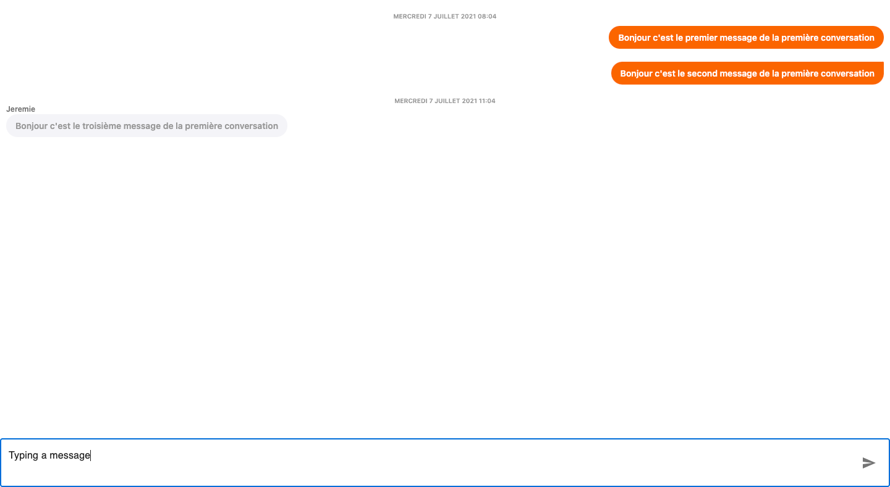
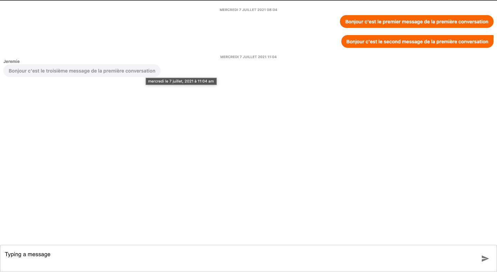

# Mugisha's messaging interface

### Implemented Features:

- Display a list of all the conversations
- Allow the user to select a conversation
  - Inside the conversation, there is a list of all the messages between these two users.
  - As a user, you can type and send new messages in this conversation

### Some decisions

#### Using swr
Using a data fetching library will avoid a lot of repeated code and remove the need to use a state management library to handle the data.

#### using io-ts
Allows me to do typescript runtime validation

#### Wrapping components from external library
I wrapped all the components from the 3rd party library i use so it can easily be modified later on.

### Screenshots :

Here are a few screenshots of what I've implemented

  
Click to see the pages

  
Mobile list :

Desktop list :

Mobile conversation :

Mobile empty conversation :

Desktop conversation :

Desktop conversation on hover over a message :

